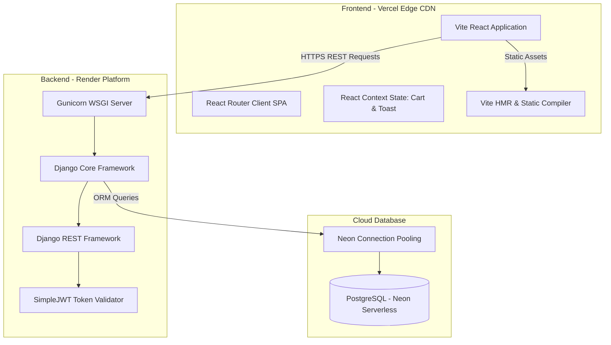
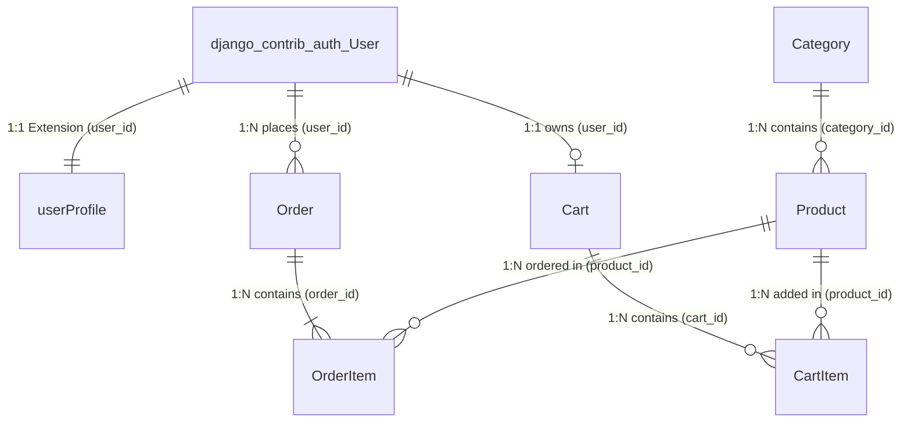
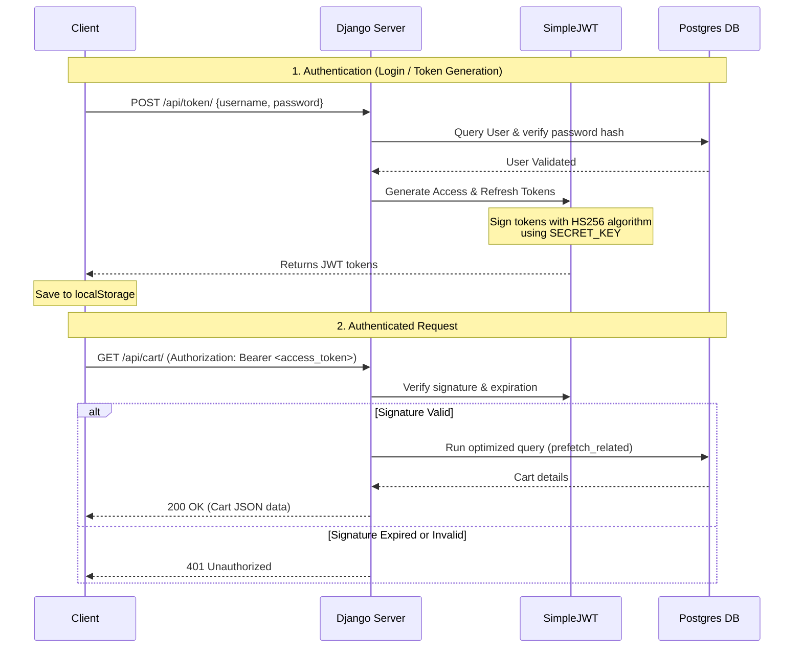

# SonuCart: Full-Stack E-Commerce Deep-Dive Interview Preparation Guide

This guide is an extensive, production-grade technical manual for the **SonuCart** full-stack e-commerce platform. It provides a deep architectural, system design, database, and frontend-backend engineering analysis. It is designed to help you ace software engineering interviews (Mid/Senior level) by explaining exactly *why* and *how* different technologies, optimizations, and patterns are implemented.

---

## 🗺️ Section 1: High-Level System Architecture & Technology Decisions

SonuCart is built on a decoupled, stateless **Client-Server Architecture**. Below is the comprehensive topology of the system:



### Detailed Infrastructure & Decoupling Justifications

#### 1. React + Vite on Vercel (Frontend SPA)
* **Single Page Application (SPA):** By serving a single bundle, client-side navigation is virtually instantaneous since it bypasses server-side page re-renders. 
* **Vite Tooling:** Vite leverages native ES modules (ESM) to deliver blazing-fast development server start-up speeds (using browser-based bundling) and rolls up clean chunks using Rollup for production.
* **Hosting Choice (Vercel CDN):** Vercel deploys the static files directly to global edge networks. This ensures the initial page loads (HTML, CSS, compiled JS) are served from cache locations nearest to the user, driving First Contentful Paint (FCP) and Cumulative Layout Shift (CLS) metrics down.
* **Routing Rewrites (`vercel.json`):** Since React Router intercepting the URL bar is purely client-side, requests to routes like `/orders` directly from the browser would result in Vercel trying to look for a physical file at `/orders/index.html` (generating a 404). We instruct Vercel's edge router to rewrite all incoming traffic back to the single `index.html` file using this rule:
  ```json
  {
    "rewrites": [
      { "source": "/(.*)", "destination": "/index.html" }
    ]
  }
  ```

#### 2. Django REST Framework on Render (Backend API)
* **Framework Selection:** Django is a batteries-included Python framework that provides built-in protections against common web vulnerabilities (SQL injection, XSS, CSRF). Django REST Framework (DRF) wraps Django models and routing into standard REST endpoints.
* **WSGI Deployment (Gunicorn):** Render deploys Django behind Gunicorn (Green Unicorn), a WSGI HTTP server. Gunicorn uses a pre-fork worker model, spinning up multiple worker processes to handle concurrent requests on multi-core server instances.
* **Statelessness:** The backend does not maintain session records in a local server file system or memory cache. Every request is verified independently using cryptographically signed JSON Web Tokens (JWTs), allowing backend instances to scale horizontally.

#### 3. Serverless PostgreSQL on Neon (Database Layer)
* **ACID Transactions:** E-commerce operations (e.g. converting a cart to an order, adjusting stock quantities) require strict transactions. If credit checks or item creations fail midway, we must rollback the whole process. PostgreSQL provides robust ACID (Atomicity, Consistency, Isolation, Durability) guarantees.
* **Serverless Architecture (Neon):** Neon decouples compute resources from physical storage.
  * **Compute Scale Down:** Neon scales compute instances to zero after periods of inactivity, minimizing cost, and rapidly cold-starts compute nodes upon receiving database connections.
  * **Decoupled Storage:** Storage is managed in serverless pages, allowing instant database branching (similar to git branches) for isolated testing without replicating data.

---

## 🗄️ Section 2: Database Schema & Entity Relationships

The schema is designed according to **Third Normal Form (3NF)** principles to eliminate data insertion, update, and deletion anomalies, with strategic denormalization applied at transaction boundaries.



### Detailed Table & Field Breakdown

#### 1. `Category`
* **Fields:** `id` (Auto-increment PK), `name` (CharField, unique), `slug` (SlugField, unique).
* **Role:** Organizes products. Slugs are indexed by default to enable fast URL searches (`/category/electronics/`).

#### 2. `Product`
* **Fields:** `id` (Auto-increment PK), `category` (ForeignKey to Category, `on_delete=models.CASCADE`), `name` (CharField), `description` (TextField), `price` (DecimalField, `max_digits=10`, `decimal_places=2`), `image` (ImageField, null/blank allowed), `created_at` (DateTimeField, auto-generated).
* **Django Model Methods:**
  * Uses `DecimalField` instead of `FloatField` to prevent binary floating-point representation errors (which would occur if adding floating numbers like `0.1 + 0.2` returning `0.30000000004` in float-imprecise mathematics).

#### 3. `userProfile`
* **Fields:** `id` (Auto-increment PK), `user` (OneToOneField to django User, `on_delete=models.CASCADE`), `phone` (CharField), `address` (CharField).
* **Role:** Extends the user model. Separating profile data from credentials limits read/write access to user login records.

#### 4. `Cart` & `CartItem`
* **`Cart` Fields:** `id` (PK), `user` (ForeignKey to User, null allowed for guest carts, `on_delete=models.CASCADE`), `created_at` (DateTimeField).
* **`CartItem` Fields:** `id` (PK), `cart` (ForeignKey to Cart, `related_name="items"`), `product` (ForeignKey to Product), `quantity` (PositiveIntegerField, default=1).
* **Calculated Properties:**
  * `CartItem.subtotal`: Calculated dynamically:
    ```python
    @property
    def subtotal(self):
        return self.quantity * self.product.price
    ```
  * `Cart.total`: Computed by summing item subtotals:
    ```python
    @property
    def total(self):
        return sum(item.subtotal for item in self.items.all())
    ```

#### 5. `Order` & `OrderItem`
* **`Order` Fields:** `id` (PK), `user` (ForeignKey to User, null allowed, `on_delete=models.CASCADE`), `total_price` (DecimalField), `created_at` (DateTimeField).
* **`OrderItem` Fields:** `id` (PK), `order` (ForeignKey to Order, `related_name="items"`), `product` (ForeignKey to Product), `quantity` (PositiveIntegerField), `price` (DecimalField).

### Core Database Design Justifications (Interview Highlights)
* **Historical Price Isolation (`OrderItem.price`):** E-commerce systems *must* capture transactional snapshots. Saving the item's purchase price inside the `OrderItem` row denormalizes the price. This isolates completed transaction records from future product price changes.
* **Cascade Deletes (`on_delete=models.CASCADE`):** Automatically purges dependent rows (e.g., removing a user's profile and cart if their main User account is deleted), preventing orphaned records in the database.

---

## ⚙️ Section 3: REST API & Authentication Mechanics

### Complete Endpoints Mapping & Operations

| Path | Verb | Payload / Params | Auth | SQL Impact / DB Operations |
| :--- | :---: | :--- | :--- | :--- |
| `/api/register/` | POST | `{username, email, password, password2}` | Public | Checks password match, creates a new `User` record, and returns a signed JWT. |
| `/api/token/` | POST | `{username, password}` | Public | Queries user by username, validates hash, and returns an access + refresh JWT pair. |
| `/api/token/refresh/` | POST | `{refresh}` | Public | Verifies the refresh token signature and issues a new access token. |
| `/api/products/` | GET | `?search=query` (optional) | Public | Queries products matching the search query using `select_related("category")`. |
| `/api/products/<id>/` | GET | URL ID parameter | Public | Returns details for a single product using `select_related`. |
| `/api/categories/` | GET | None | Public | Returns all categories. |
| `/api/cart/` | GET | None | JWT | Fetches the active user's cart using `prefetch_related("items__product")`. |
| `/api/cart/add/` | POST | `{product_id}` | JWT | Finds or creates a cart, then inserts or updates a `CartItem` record. |
| `/api/cart/update/` | POST | `{item_id, quantity}` | JWT | Updates a `CartItem`'s quantity, or deletes the record if the quantity is less than 1. |
| `/api/cart/items/<id>/delete/` | POST | URL ID parameter | JWT | Deletes the specified `CartItem` from the database. |
| `/api/orders/create/` | POST | `{name, address, phone, payment_method}` | JWT | Runs transactional logic: reads the cart, creates an `Order`, bulk-inserts `OrderItem` records, and clears the cart. |
| `/api/orders/` | GET | None | JWT | Returns the user's order history using `prefetch_related`. |
| `/api/orders/<id>/` | GET | URL ID parameter | JWT | Returns details for a specific order if it belongs to the active user. |

### JWT Cryptographic Flow Chart



* **Token Types:**
  * **Access Token:** Short-lived token sent in the authorization headers. Includes claims like `user_id` and token type.
  * **Refresh Token:** Long-lived token stored locally. Used to request a new access token when the current one expires.
* **Why Bypassing Cookie/Session IDs?** Traditional session IDs require lookup checks on every incoming request, which restricts scalability. JWT authentication is stateless: the server verifies token signatures cryptographically using a backend secret key, which reduces database lookup overhead.

---

## ⚡ Section 4: Performance Optimizations & Serializer Context

### 1. Solving the N+1 Query Bottleneck
* **The Problem:** In serializing a list of products, accessing the related `category` for each product in `ProductSerializer` triggers a separate query for each item, resulting in $N+1$ queries.
* **The Solution:** Use Django's database optimization techniques:
  * **`select_related` (SQL JOIN):** Used in the product list and product details views to perform an SQL `INNER JOIN` in a single query:
    ```python
    products = Product.objects.select_related("category").all()
    ```
    This reduces the database query overhead from $N+1$ to exactly 1 query.
  * **`prefetch_related` (Batch Querying):** Used in cart and order views to fetch related items in a second, separate batch query and map them in-memory:
    ```python
    orders = Order.objects.filter(user=request.user).prefetch_related('items__product')
    ```
    This reduces the query count from $N+1$ to exactly 2 queries.

### 2. Side-by-Side SQL Query Translations

#### Unoptimized Product List Query
```python
products = Product.objects.all()
for p in products:
    print(p.category.name) # Triggers a DB lookup for each loop
```
**Generated SQL:**
```sql
SELECT "store_product"."id", "store_product"."name", "store_product"."price", "store_product"."category_id" FROM "store_product";
-- For EACH item, the following query is executed:
SELECT "store_category"."id", "store_category"."name" FROM "store_category" WHERE "store_category"."id" = 1;
SELECT "store_category"."id", "store_category"."name" FROM "store_category" WHERE "store_category"."id" = 2;
...
```

#### Optimized Product List Query
```python
products = Product.objects.select_related("category").all()
for p in products:
    print(p.category.name) # Reads cached categories from memory
```
**Generated SQL:**
```sql
SELECT "store_product"."id", 
       "store_product"."name", 
       "store_product"."price", 
       "store_product"."category_id",
       "store_category"."id",
       "store_category"."name"
FROM "store_product"
INNER JOIN "store_category" ON ("store_product"."category_id" = "store_category"."id");
```
* **Result:** All required data is retrieved in a single database roundtrip.

### 3. Batch Writes (`bulk_create`)
When converting a cart to an order, saving order items sequentially in a loop results in multiple database writes. SonuCart groups these writes into a single multi-row `INSERT` query using `bulk_create`:
```python
order_items_to_create = [
    OrderItem(
        order=order,
        product=item.product,
        quantity=item.quantity,
        price=item.product.price,
    ) for item in cart_items
]
OrderItem.objects.bulk_create(order_items_to_create)
```
**Generated SQL:**
```sql
INSERT INTO "store_orderitem" ("order_id", "product_id", "quantity", "price") 
VALUES (1, 5, 2, 29.99), (1, 12, 1, 99.99);
```
* **Result:** Inserts all order item rows in a single database transaction.

### 4. Serializer Method Optimizations & Context Passing
* **The Problem:** Returning relative media paths like `/media/products/img.jpg` from the backend API results in broken images on frontend clients hosted on separate domains.
* **The Solution:** Pass the `request` object into the serializer context:
  ```python
  serializer = OrderSerializer(order, context={'request': request})
  ```
  The serializer uses this context to construct absolute URLs (e.g. `https://api.sonucart.com/media/products/img.jpg`):
  ```python
  class OrderItemSerializer(serializers.ModelSerializer):
      product_image = serializers.SerializerMethodField()

      def get_product_image(self, obj):
          request = self.context.get('request')
          if obj.product and obj.product.image and request:
              return request.build_absolute_uri(obj.product.image.url)
          return None
  ```

---

## 💻 Section 5: Frontend Page Flow & State Management

### The 10 Frontend Pages Breakdown

#### 1. Product Catalog Page (`ProductList.jsx`)
* **Role:** The entry point for product listings.
* **State Management:**
  * `products` (Array): Stores fetched product rows.
  * `search` (String): Tracks input field text.
  * `searchQuery` (String): Stores the search term sent to the API.
  * `loading` (Boolean): Controls skeleton loading animations.
* **Key Patterns:** Decouples input state (`search`) from the query trigger state (`searchQuery`) to prevent redundant API requests.

#### 2. Product Details Page (`ProductDetails.jsx`)
* **Role:** Displays detailed information for a single product.
* **State Management:**
  * `product` (Object): Stores details of the active product.
  * `quantity` (Integer): Manages selected quantity before adding it to the cart.
* **Key Patterns:** Extracts URL parameter using `useParams()` and uses local quantity state to avoid unnecessary global context updates.

#### 3. Shopping Cart Page (`CartPage.jsx`)
* **Role:** Manages items in the user's cart.
* **State Management:** Uses `useCart()` context to read and update cart items.
* **Key Patterns:** Updates items and recalculates totals.

#### 4. Checkout Page (`CheckoutPage.jsx`)
* **Role:** Collects shipping details and payment choices.
* **State Management:**
  * `form`: `{name, address, phone, payment_method: "COD"}`
  * `isSubmitting`: Blocks duplicate submit requests.
* **Key Patterns:** Validates form inputs on the client side before sending database write requests to `/api/orders/create/`.

#### 5. Order Success Page (`OrderSucces.jsx`)
* **Role:** Provides purchase confirmation alerts.
* **State Management:** Stateless display page.
* **Key Patterns:** Uses keyframe CSS animations for success states.

#### 6. Order History Page (`MyOrders.jsx`)
* **Role:** Lists the user's past orders.
* **State Management:**
  * `orders` (Array): List of past orders.
* **Key Patterns:** Uses `authFetch` to load secure user orders.

#### 7. Order Details Page (`OrderDetails.jsx`)
* **Role:** Displays a detailed summary for a specific order.
* **State Management:**
  * `order` (Object): Active order metadata.
* **Key Patterns:** Uses `useParams()` to fetch and display the selected order.

#### 8. Order Cancellation Page (`CancelOrder.jsx`)
* **Role:** Collects reasons for order cancellations.
* **State Management:**
  * `reason` (String): Selected cancellation reason.
* **Key Patterns:** Submits cancellation details to the backend.

#### 9. Login Page (`Login.jsx`)
* **Role:** Validates credentials and returns JWT tokens.
* **State Management:**
  * `form`: `{username, password}`
* **Key Patterns:** Saves returned tokens to the browser's local storage.

#### 10. Signup Page (`Signup.jsx`)
* **Role:** Registers a new user account.
* **State Management:**
  * `form`: `{username, email, password, password2}`
* **Key Patterns:** Validates matching passwords before sending registration requests to the server.

---

### Global Context vs. Local Component State

```
                      +-------------------+
                      |   CartProvider    |  <-- Global Context API
                      |  - cartItems: []  |
                      |  - total: 0       |
                      +-------------------+
                               |
            +------------------+------------------+
            |                                     |
            v                                     v
  +--------------------+                +--------------------+
  |    Navbar.jsx      |                |    CartPage.jsx    |
  |  - Reads badge Qty |                |  - Modifies Qty    |
  +--------------------+                |  - Removes items   |
                                        +--------------------+
                                                  |
                                                  v
                                        +--------------------+
                                        | CartItemRow.jsx    |
                                        | - Uses Local State |
                                        |   for row animation|
                                        +--------------------+
```

* **Global State (Context API):** Used for shared app states like the active shopping cart or toast notification feeds. This avoids prop-drilling across unrelated components.
* **Local State (`useState`):** Used for transient UI states (e.g. form inputs, search parameters, quantity counters) to keep the app responsive.

---

### Window Custom Event Bridge Pattern
To allow utility scripts (like [auth.js](file:///e:/All%20Programs/ECOMMERCE_PROJECT/frontend/src/utils/auth.js)) to trigger UI actions (like toast notifications or page routing) without importing React hooks:
1. **Plain JS Dispatches Event:**
   ```javascript
   window.dispatchEvent(new CustomEvent('app:toast', { 
     detail: { message: "Session expired.", type: "error" } 
   }));
   ```
2. **React Bridge Component Listens:**
   ```javascript
   function EventBridge() {
     const toast = useToast();
     useEffect(() => {
       const handleToast = (e) => toast[e.detail.type](e.detail.message);
       window.addEventListener('app:toast', handleToast);
       return () => window.removeEventListener('app:toast', handleToast);
     }, [toast]);
     return null;
   }
   ```

---

## 🔒 Section 6: Security, CORS & Web Protections

### 1. Insecure Direct Object Reference (IDOR) Protection
IDOR occurs when an application exposes a reference to an internal database object (like an order ID) in a way that lets users access other people's data by changing the ID.
* **The Vulnerability:**
  ```python
  # Vulnerable View: Allows viewing any order by changing the ID in the URL
  order = Order.objects.get(id=pk)
  ```
* **The Mitigation:** Filter the query using the requesting user object:
  ```python
  # Secure View
  order = Order.objects.get(id=pk, user=request.user)
  ```

### 2. SQL Injection Prevention
* **Mechanism:** Django's ORM uses parameterized queries for its database operations:
  ```python
  # Safe ORM Query
  Product.objects.filter(name__icontains=user_input)
  ```
  Django compiles this query and passes `user_input` separately as a parameter, preventing malicious SQL strings from being executed.

### 3. Cross-Origin Resource Sharing (CORS) Configuration
To allow the frontend hosted on Vercel to make requests to the backend API hosted on Render, CORS headers must be configured:
* **Backend Configuration (`settings.py`):**
  ```python
  INSTALLED_APPS = [
      ...
      'corsheaders',
  ]
  MIDDLEWARE = [
      'corsheaders.middleware.CorsMiddleware', # Placed near the top
      ...
  ]
  CORS_ALLOWED_ORIGINS = [
      "https://sonucart-frontend.vercel.app",
      "http://localhost:5173", # Allowed origins for development
  ]
  ```

---

## 💬 Section 7: Key Interview Q&As (Master List)

### Q1: What is the N+1 query problem, and how do you solve it in Django?
**Answer:**
The N+1 query problem occurs when the ORM executes one query to fetch parent records, and then executes an additional query for each of the $N$ records to load related tables during serialization.
In SonuCart, I solved this by:
* Using `select_related('category')` for single-valued relationships (Foreign Keys/One-to-One), which performs a SQL `JOIN` on the database level in a single query.
* Using `prefetch_related('items__product')` for multi-valued relationships (Many-to-Many/Reverse Foreign Keys), which executes a separate query to fetch all child rows in one batch and maps them in-memory.

### Q2: Why did you choose a decimal field instead of a float field for product prices?
**Answer:**
Computers represent floats as binary approximations. This can lead to precision loss and rounding errors during calculations (e.g. `0.1 + 0.2` returning `0.30000000000000004`). For financial records, rounding errors are unacceptable. Django's `DecimalField` maps to the PostgreSQL `numeric` type, which stores numbers as exact strings, avoiding binary calculation errors.

### Q3: How do you handle concurrency issues (such as two users buying the last product item simultaneously)?
**Answer:**
Simultaneous checkout requests can trigger a race condition where both users are allowed to purchase an item that only has one unit left in stock.
To prevent this, I would implement **Pessimistic Locking** using Django's `select_for_update()` inside a transaction block:
```python
with transaction.atomic():
    product = Product.objects.select_for_update().get(id=product_id)
    if product.stock_qty >= requested_qty:
        product.stock_qty -= requested_qty
        product.save()
        # Create order...
```
`select_for_update()` locks the product's database row until the transaction completes, forcing other requests to wait and preventing double-purchasing.

### Q4: Why is Gunicorn used in production instead of Django's default runserver?
**Answer:**
Django's default development server (`runserver`) is single-threaded and not optimized for production. It processes requests one at a time, meaning a slow request will block all subsequent traffic. Gunicorn (Green Unicorn) is a WSGI HTTP server that uses a pre-fork worker model. It creates multiple worker processes to handle concurrent requests in parallel, improving application throughput.

### Q5: How do you protect frontend routes in React?
**Answer:**
I implement a protected route wrapper component (`PrivateRouter.jsx`) that checks for the presence of authentication tokens:
```javascript
import { Navigate, Outlet } from 'react-router-dom';

const PrivateRouter = () => {
    const isAuthenticated = !!localStorage.getItem("access_token");
    return isAuthenticated ? <Outlet /> : <Navigate to="/login" replace />;
};
```
In `App.jsx`, I wrap private views (like Checkout and Order History) inside this routing barrier:
```javascript
<Route element={<PrivateRouter />}>
    <Route path="/checkout" element={<CheckoutPage />} />
    <Route path="/orders" element={<MyOrders />} />
</Route>
```

### Q6: How does passing context to serializers help in Django REST Framework?
**Answer:**
DRF serializers are isolated from request parameters by default. Passing the request object via context:
```python
serializer = OrderSerializer(order, context={'request': request})
```
allows nested serializers to access request data. This is useful for building absolute URLs for media assets (like product images) dynamically using `request.build_absolute_uri()`.

### Q7: What are the security trade-offs of storing JWTs in local storage vs. HTTPOnly cookies?
**Answer:**
* **`localStorage`:** Easy to implement and access via JavaScript, but vulnerable to **Cross-Site Scripting (XSS)** attacks. If a malicious script runs on the client side, it can access and steal the tokens.
* **HTTPOnly Cookies:** Secure against XSS since JavaScript cannot access cookies with the `HttpOnly` flag. However, they are vulnerable to **Cross-Site Request Forgery (CSRF)** attacks, which must be mitigated using CSRF tokens or `SameSite` cookie attributes.

### Q8: What is the benefit of database normalization, and where did you denormalize data in this schema?
**Answer:**
Database normalization removes data redundancies and ensures data integrity. However, some scenarios warrant denormalization to keep historical records accurate.
In this project, I denormalized data by saving the product's price in the `OrderItem` table at the time of purchase (`OrderItem.price = Product.price`). This isolates completed transaction records from future product price changes.

### Q9: How would you resolve the frontend-backend mismatch on the order cancel feature?
**Answer:**
The frontend cancels orders by making a request to `POST /api/orders/<id>/cancel/`, but this route is not defined on the backend.
To resolve this:
1. Create a `cancel_order` view in `views.py` that verifies the order belongs to the user and updates its status to "Cancelled".
2. Register the route in `urls.py`:
   ```python
   path("orders/<int:pk>/cancel/", views.cancel_order),
   ```

### Q10: How would you optimize React rendering performance for large product grids?
**Answer:**
For rendering large grids of product cards:
1. **Unique Keys:** Provide unique `key={product.id}` values to help React identify which items have changed.
2. **React.memo:** Wrap the `ProductCard` component in `React.memo` to prevent re-rendering cards whose props haven't changed.
3. **Lazy Loading:** Implement image lazy loading using the `loading="lazy"` attribute on image tags.
4. **Pagination:** Load products in small batches using window pagination or infinite scroll inputs to limit DOM node overhead.

### Q11: What database indexing strategies would you use for this application?
**Answer:**
I would apply database indexes to fields that are frequently used in search queries and lookups:
* **Product Name:** Add an index to search fields to speed up text queries:
  ```python
  class Product(models.Model):
      name = models.CharField(max_length=255, db_index=True)
  ```
* **Composite Indexes:** If we regularly filter products by both category and creation date, we can add a composite index:
  ```python
  class Meta:
      indexes = [
          models.Index(fields=['category', 'created_at']),
      ]
  ```
Indexes speed up read operations but slow down write operations, so they should be used selectively.

### Q12: How do you handle database connections efficiently in a serverless environment like Neon?
**Answer:**
In serverless environments, applications scale up rapidly, creating and tearing down database connections frequently. This can exceed database connection limits.
To mitigate this:
1. **Connection Pooling:** Use connection pooling tools (like PgBouncer or Neon's built-in connection pooling port) to pool and reuse active database connections.
2. **Close Connections:** Configure Django to close database connections immediately after requests complete by setting `CONN_MAX_AGE = 0` in database settings, freeing up connections for other instances.
